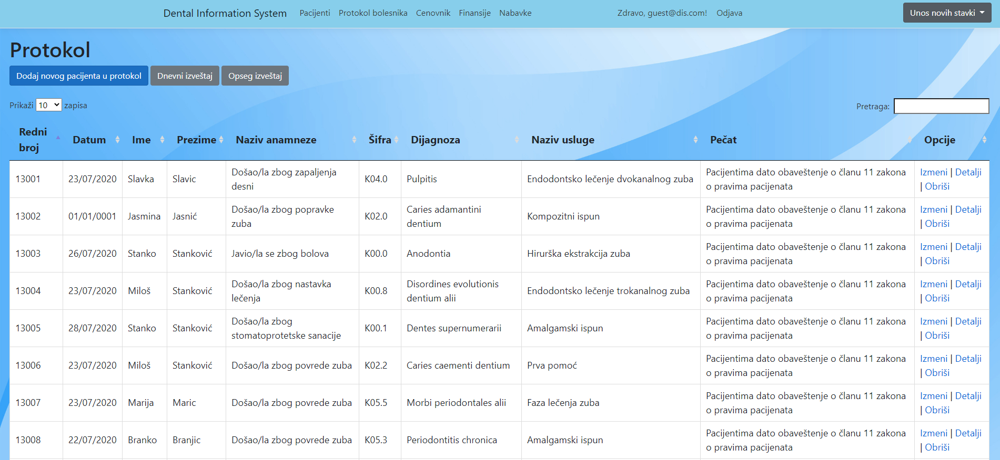
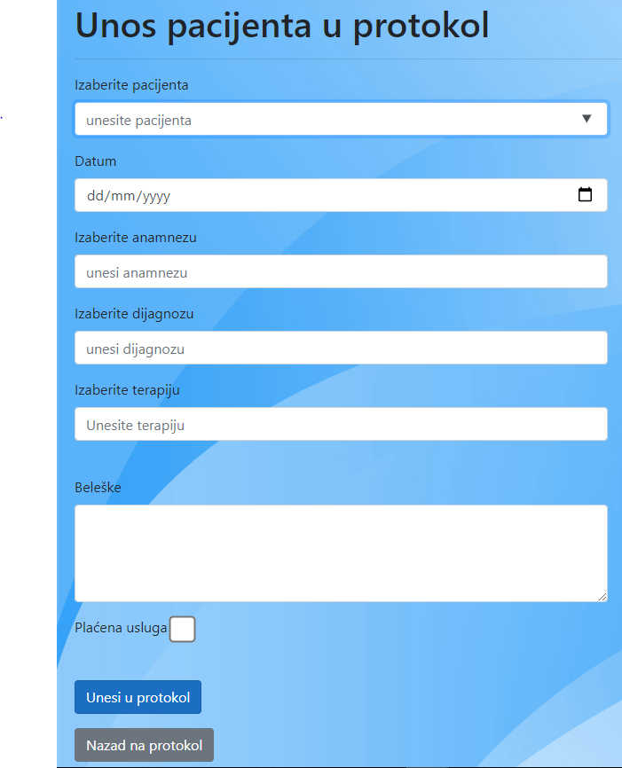
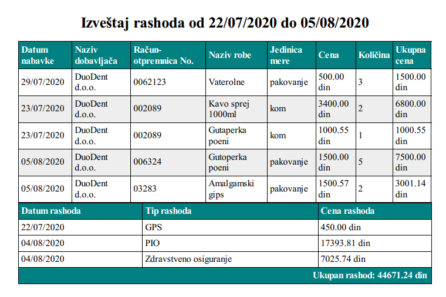

Dental Information System for managing Patients and Dental Protocol.
Custom made reports for Protocol with date filtering.
Financial part of information system includes incomes and expenses for dental business and supply.
Custom reports for all periods within chosen date range and reports for all expenses across information system.

### Technologies used:
- ASP.NET Core 3.1
- Entity Framework Code First
- MS SQL Server
- DataTables for client-side searching, sorting and pagination
- JavaScript/JQuery
- Rotativa for custom reports(available exporting to PDF)
- ASP.NET Core Identity for Authentication and Authorization
**************************************************************

Regular dental protocol with option to export report to PDF

Creating new protocol data (server-side validation)

Expense report from multiple tables throughout Dental IS ready for export to PDF.

